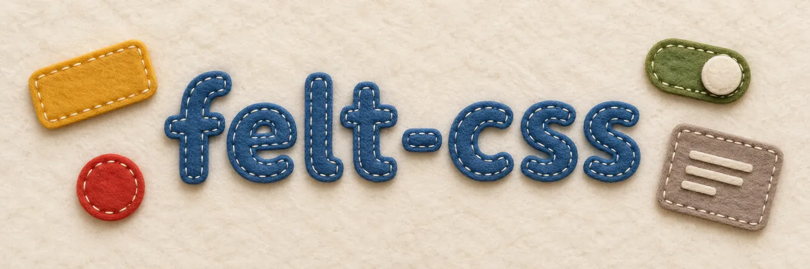
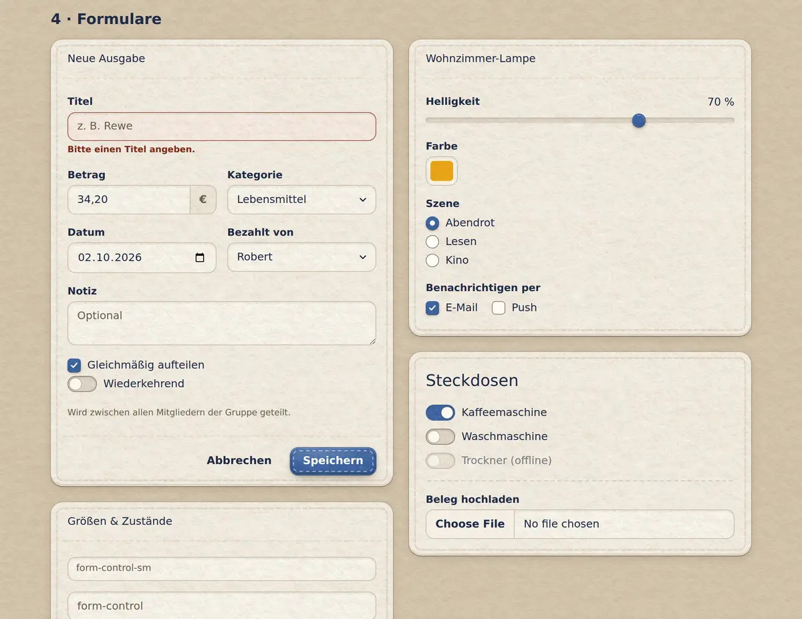
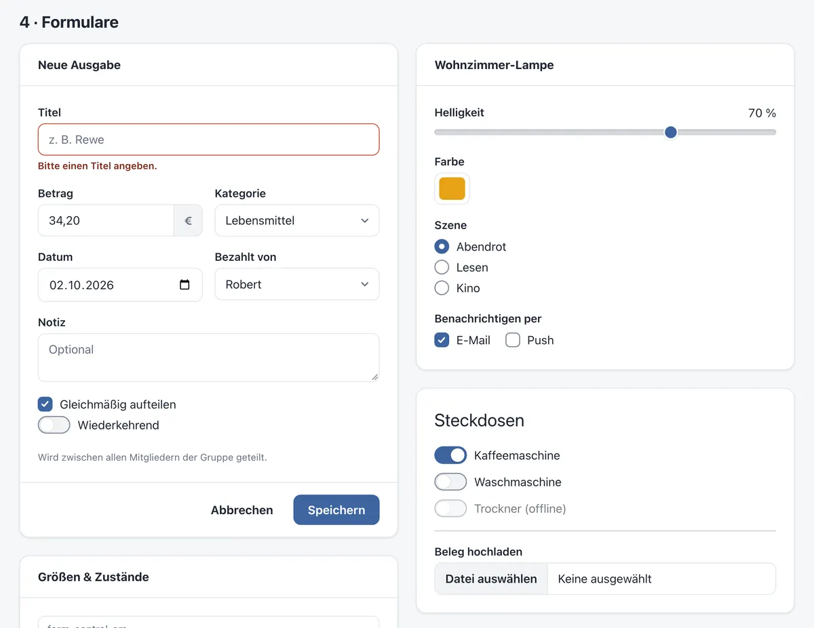
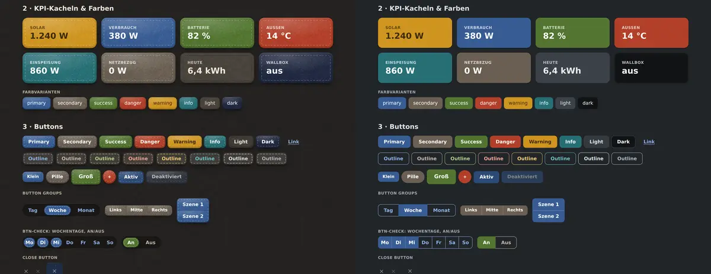
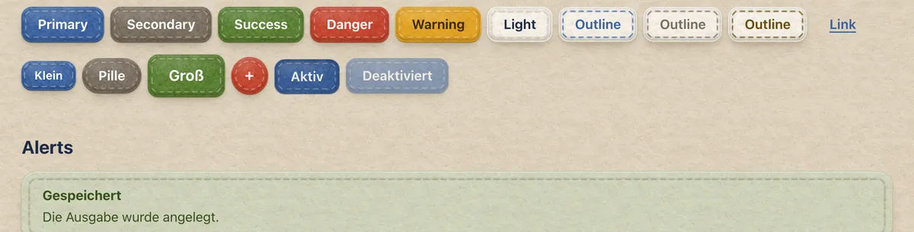

<p align="center"></p>

# felt-css

**[Documentation](https://felt-css.rocu.de/)** · [Examples](https://felt-css.rocu.de/docs/examples/)

**Bootstrap, but made of wool felt.** A small, dependency-free CSS toolkit with Bootstrap 5 class names
and two looks: a clean one for everyday work, and a cosy one where every card is cut from felt and every
button is sewn on by hand. One attribute switches between them, and nothing on the page moves when you do.

| Felt | Clean |
|---|---|
|  |  |

Both looks come in light and dark; dark felt is charcoal.





## A word up front

- I built this for myself, for my own little apps (a smart-home dashboard, a shared-expenses app, a
  blog). It does exactly what I need and not much more.
- I don't accept pull requests (benevolent dictator and all that), but forks are very welcome — please
  take it, change it, make it yours. If you come up with something lovely, I'll happily steal the best
  ideas back. 🧵
- Public domain ([The Unlicense](LICENSE)): no strings attached, not even a thread. (The docs borrow from
  Bootstrap's, see [License](#license).)

## Quick start

No build step. Copy `felt.css` and the `img/` folder next to it, then:

```html
<html data-look="felt">   <!-- leave the attribute out for the clean look -->
<head>
  <link rel="stylesheet" href="felt.css">
</head>
<body>
  <div class="card">
    <div class="card-header">Neue Ausgabe</div>
    <div class="card-body">…</div>
    <div class="card-footer">
      <button class="btn">Abbrechen</button>
      <button class="btn btn-primary">Speichern</button>
    </div>
  </div>
</body>
```

Everything else (components, dark mode, Bootstrap's JavaScript, how the felt works, browser support) is
in the [documentation](https://felt-css.rocu.de/). `index.html` in the repo is a demo of everything
(`?look=clean|felt` and `?theme=light|dark` in the URL pick a look and a theme).

## Rebuilding

Only needed when you change felt-css itself (plain `python3`):

```sh
python3 tools/build_assets.py      # felt textures and seams in img/ as SVG
python3 tools/build_utilities.py   # the generated grid and utility blocks in felt.css
python3 tools/build_docs.py --strict   # docs/ from docs-src/
```

Pushing to `main` publishes the docs with GitHub Pages.

## License

- `felt.css`, `img/`, `tools/`, `index.html` and the docs' own pages and examples are public domain under
  [The Unlicense](LICENSE).
- `docs-src/` and `docs/` adapt the [Bootstrap 5.3 documentation](https://getbootstrap.com/docs/5.3/):
  - its text stays under [CC BY 3.0](https://creativecommons.org/licenses/by/3.0/);
  - its example markup and icons stay under the MIT License, © The Bootstrap Authors
    ([docs/LICENSE-bootstrap.txt](docs/LICENSE-bootstrap.txt)).
- The plush icons in `docs/assets/plush/` come from [ZiWoAS](https://github.com/shostakovich/ziwoas).
  They are © Robert Curth, all rights reserved, and not part of the public-domain release.
